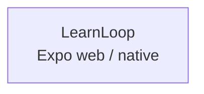

# Azure Debug Plan

> This plan is the source of truth for generating the
> VS Code debug setup in this workspace.
>
> **Status:** Implemented
> **Execution Mode:** auto
> **Created:** 2026-09-20T00:00:00Z
> **Last Updated:** 2026-09-20T00:00:00Z
>
> LearnLoop is a single offline-first Expo TypeScript app. It has no Azure SDK
dependencies, backend service, database, migration system, or emulator needs.

---

## Prerequisites

| Tool / Extension | Category | Service(s) | Installed | Version |
|------------------|----------|------------|-----------|---------|
| Node.js | Runtime | * | ✅ | 24.19.0 |
| npm | Package manager | * | ✅ | 11.17.0 |
| Expo CLI | Runtime / CLI | * | ✅ | 57.0.26 via `npx expo` |
| Android Studio / Xcode tooling | Native platform tooling | * | ❓ | — |
| Edge | Browser | LearnLoop | ✅ | Installed |
| VS Code JavaScript Debugger | Debug | * | ✅ | Built-in |
| React Native Tools | Debug extension | LearnLoop | ❓ | — |
| Expo Tools | Debug extension | LearnLoop | ✅ | 1.6.3 |

> ⚠️ **Action required:** Confirm Android tooling, Xcode tooling where applicable,
> and React Native Tools before debugging native targets. Web debugging is ready
> through Edge and the built-in JavaScript debugger.

---

## Debug Configurations

Each checked row below produces a VS Code debug configuration in `.vscode/launch.json`.

| Generate | Debug Config Name | Service Label | Service Root | Project Type | Runtime | Version | Azure Dependencies |
|----------|--------------------|---------------|--------------|--------------|---------|---------|---------------------|
| [x] | LearnLoop (Expo web debug) | LearnLoop | ./ | frontend-spa | node-ts | 24.19.0 | — |

ℹ️ Project Type Descriptions

| Project Type | Description |
|-------------|-------------|
| frontend-spa | Runnable Expo and React Native frontend with web, Android, and iOS launch targets |

---

## Orchestrator

No emulator containers are required because LearnLoop has no Azure service dependencies.

| Orchestrator | Container Runtime | Compose Command | Description |
|-------------|-------------------|-----------------|-------------|
| Docker Compose | Docker | `docker compose` | Default fallback if a future local emulator dependency is introduced; no containers are needed for the current app |

---

## Emulators

No Azure service dependencies were detected, so no local emulators are required.

| Dependent Service | Emulator | Purpose |
|-------------------|----------|---------|
| — | — | — |

---

## Architecture Diagram

LearnLoop runs as one Expo development server and keeps lesson content, progress, bookmarks, and settings local to the app.

---

## Convenience Scripts

| Generate | Script | Registered In | Description |
|----------|--------|---------------|-------------|
| [x] | start | ./package.json | Start the LearnLoop Expo development server |
| [x] | web | ./package.json | Start LearnLoop in the browser |
| [x] | android | ./package.json | Start LearnLoop for an Android device or emulator |
| [x] | ios | ./package.json | Start LearnLoop for an iOS simulator; requires macOS/Xcode |

## API Test Collections

No HTTP endpoints or background triggers were detected. The app routes are client-side navigation screens.

## Debug Configuration Checklist

Debug Configuration Checklist:
✅ LearnLoop (Expo web debug) — Expo web dev task started successfully on http://localhost:8082 and responded with HTTP 200 while the browser debug configuration targeted the same URL.
